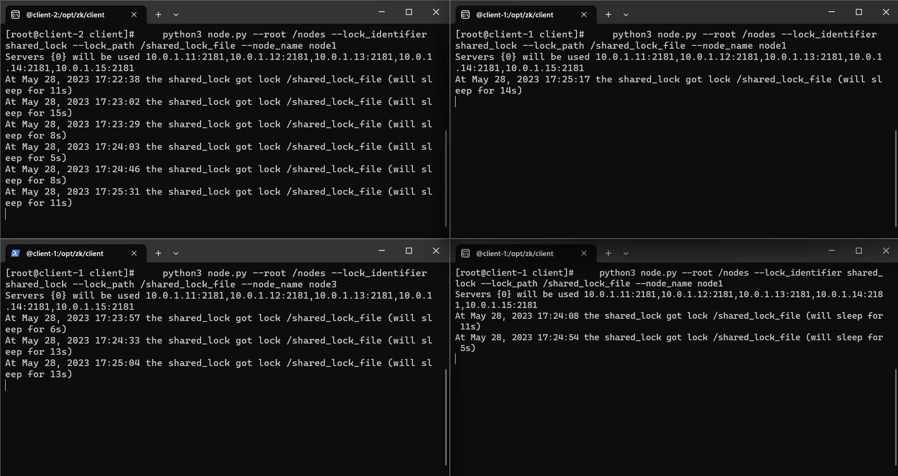

# DSA - úloha 2
Hana Hrkalová

28.5.2023

## Přeložení a spuštění programu
Řešení se skládá pouze z jednoho test.py python souboru

Spustíme projekt demo-5 pomocí příkazu vagrant up
Následně se připojíme na libovolné klienty v demu, pomocí příkazu

     docker exec -it client-1 bash

V něm spustíme soubor test.py (nejjednoduší způsob je založit nový file pomocí vi a překopírovat jej)

Aplikaci spustíme (například) následujícím způsobem

    python3 node.py --root /nodes --lock_identifier shared_lock --lock_path /shared_lock_file --node_name node1
    python3 node.py --root /nodes --lock_identifier shared_lock --lock_path /shared_lock_file --node_name node2
    python3 node.py --root /nodes --lock_identifier shared_lock --lock_path /shared_lock_file --node_name node3
    python3 node.py --root /nodes --lock_identifier shared_lock --lock_path /shared_lock_file --node_name node1
    python3 node.py --root /nodes --lock_identifier shared_lock --lock_path /shared_lock_file --node_name node2

## Popis parametrů příkazu

- --root nastaví defaultní jmenný prostor v kterém aplikace běží a komunikují přes něj uzly s procesy.
- --lock_identifier nastaví jméno sdíleného zámku, může jich být víc v shared_lock_file (soubor se sdílenou pamětí procesů určený ke - komunikaci)
- --lock_path nastaví cestu k soubor sdílené paměti zámků
- --node_name určí na kterém uzlu daný proces poběží

## Popis programu
Program používá python argument parser pro parsování předaných parametrů v spouštěcím příkazu
Ty jsou následně předány třídě ApplicationNode

Tato tříde nejprve spustí svou instanci, zkontorluje zda existuje root soubor, pokud ano připojí se do něj, pokud ne, tak jej založí.
Následně podobným způsobem vytvoří uzly (klienty s procesy).

Program vypisuje časy jednotlivých úloh procesu a čas kdy tento požadavek vznikl. Lze jednoduše spočítat z času vzniku požadavků, že musel čekat na kritickou sekci než v ní doběhnou ostatní procesy. 

Pokud je program násilně ukončen (ctrl + c) vypíše výjimku že nebyl správně ukončen, ostatní procesy se ale však běhu přizpůsobí a jíž nepočítají s zabíráním kritické sekce tohoto procesu.

### Výsledek programu

